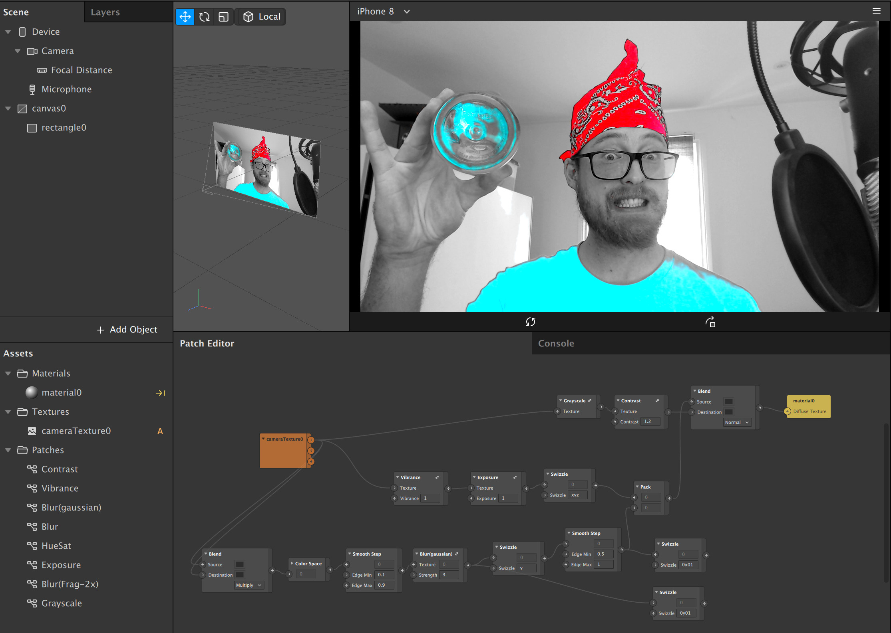

## Saturation Selection in Spark AR

How to make a mask based on saturation levels.

[Tutorial on YouTube](https://www.youtube.com/watch?v=1NdmVlWsxcU)

## Resources

[Color adjustment patches](https://github.com/positlabs/spark-color-adjust)

[Chromakey tutorial](https://www.youtube.com/watch?v=vPuObKf-55I)

[@spacegoose shirts](http://toolsandtoys.net/graphic-tees-by-eric-geusz-spacegoose/)

Learn more stuff by watching my [Spark AR Tutorials on YouTube!](https://www.youtube.com/playlist?list=PLAZp2Vi7Gfspzyla4RrCO6BzVzYW7Lnb-)

Follow me on Instagram [@positlabs](https://instagram.com/positlabs) and try out my effects!

Browse my open-source [Spark AR repositories on Github!](https://github.com/search?q=user%3Apositlabs+spark)

Have questions? Join the [Spark AR Community](https://www.facebook.com/groups/SparkARcommunity/) group on Facebook.

## Donations

If you used this in client projects, or simply enjoyed making effects with my open-source projects, please consider a donation or sponsorship. One-time donations can be made with PayPal. Subscriptions can be through PayPal or [Github Sponsorships](https://github.com/sponsors/positlabs).

